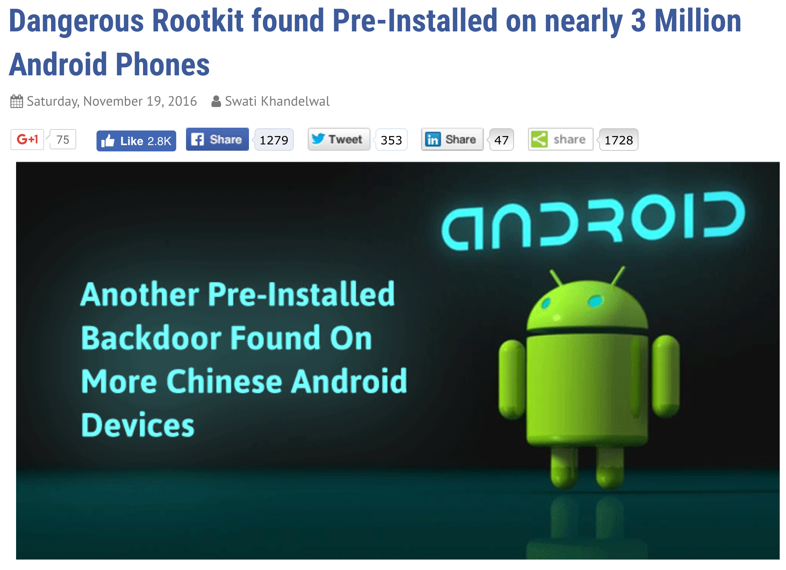
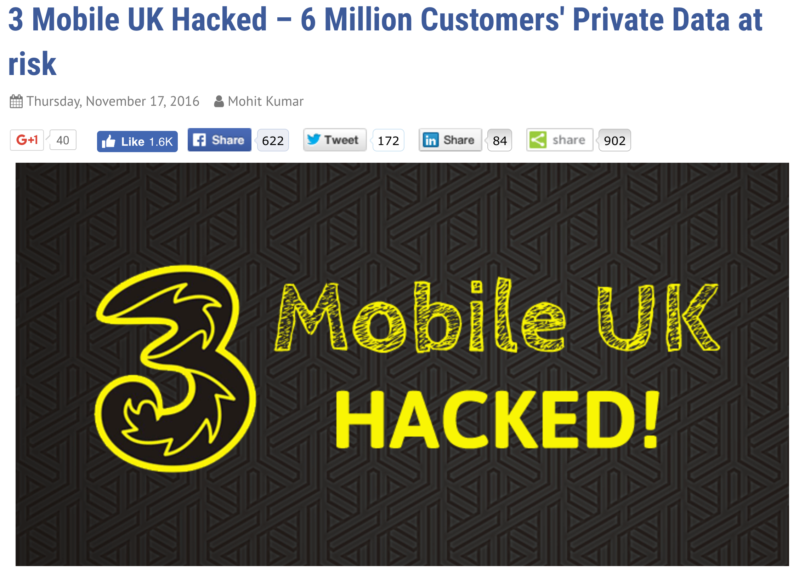
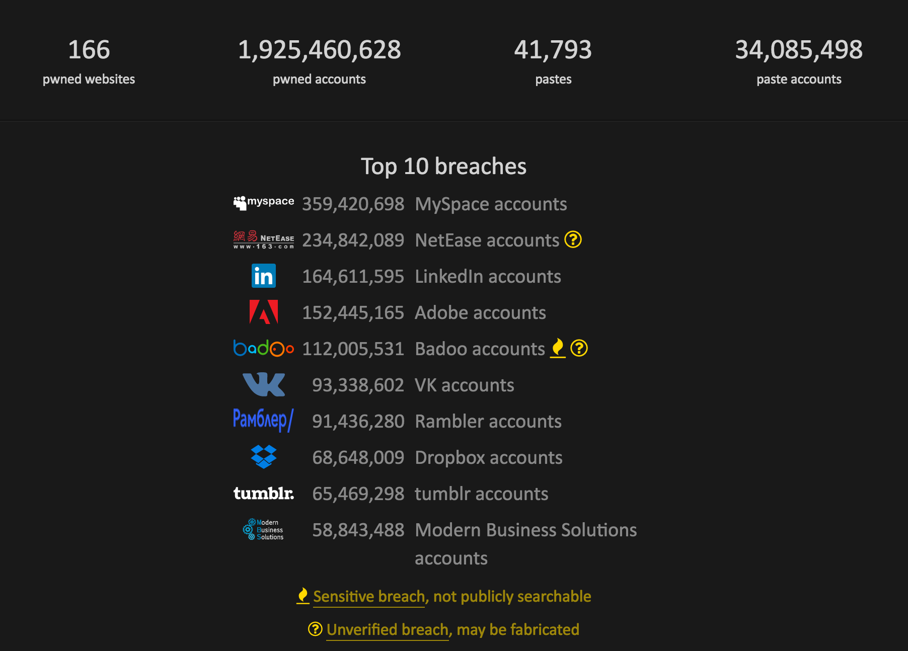
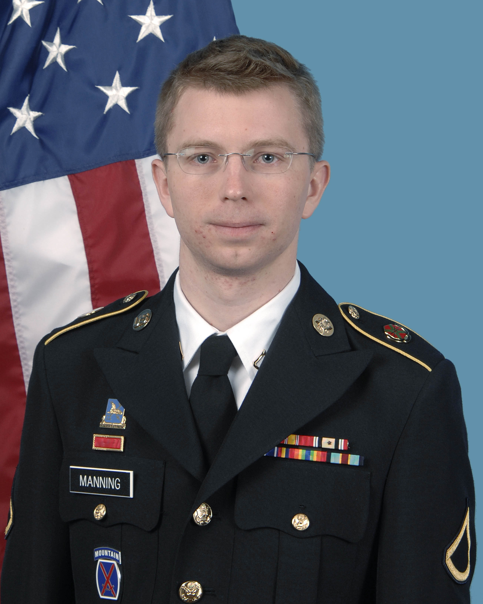
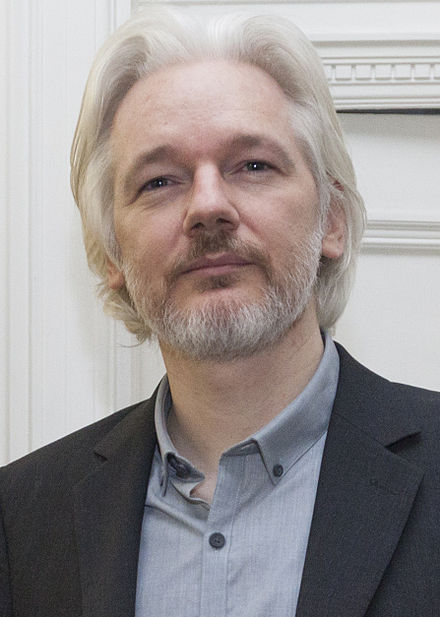
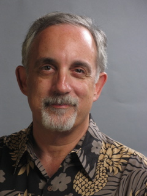
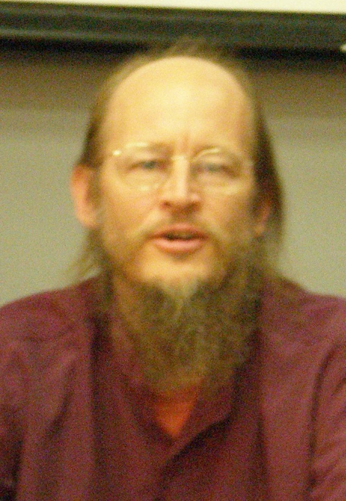

title: Programming and Ethics - (Open) talk about what we're doing
author:
  name: Thiago Costa
  mail: thiago@arroadie.com
  url: http://www.arroadie.com
  twitter: arroadie
output: index.html 
style: style.css

--
# Programming and Ethics

#### A (open) talk about the morals of what we're doing

--
# About me
* (Never finished my) BS in Physics
* Game Dev Entusiast
* Love to learn
* \>100 parallel projects initiated (~2 finished)

--
# Why ethics?

>_1. rules of behavior based on ideas about what is __morally good and bad___

>_2. The __principles of conduct__ governing an individual or a group_

Merrian-Webster Dictionary

--
# Why ethics?

[The Copenhagen Interpretation]([https://en.wikipedia.org/wiki/Copenhagen_interpretation) of Quantum Mechanics says a particle is spinning cloclwise and counter clockwise at the same time until you look at it.
At that moment it becomes one or the other.

--
# Why ethics?

The same Copenhagen Interpretation says a situation is god and bad at the same time until you look at it.
At that moment it's your fault and you'll be blamed for it.

--
# Why it's important?
Exercizing ethics prevents bad side effects of what you're doing.

People are affected by what you do! (even that one line change)

--
# Why should you care?
We all are the product!

These actions are affecting your life and everyone else around (the world)

--
### How nobody (or at least not enough people) is caring?

--
### How nobody (or at least not enough people) is caring?

--
### How nobody (or at least not enough people) is caring?

--
### Who's changing it?

--
### How can we change it?
Follow the guidelines!

* Contribute to society and human well being
* Avoid harm others
* Be honest and trustworthy
* Give proper credit
* Respect privacy
* Honor confidenciality
* Approve only when something complies with all the above (a "LGTM" is a contract)
* Assume responsability
* Ensure responsible use of data
* Do no engage on deceptive practices
* Improve safeness

--
# How can we change it?
 
 
Engage the SDD (Skynet Driven Development)

--
# How can we change it?
 
 
Don't be the big brother

--
# How can we change it?
 
 
Trust, but encrypt

--
# How can we change it?
 
 
Make proper use of the licenses

--
# How can we change it?
 
 
Write only what you need

--
# How can we change it?
Follow Asimov laws and fix bugs
>_A robot may not injure a human being or, through inaction, allow a human being to come to harm_

Fixing bugs (by criticity), you avoid consumers of your service to be harmed in any way.

--
# How can we change it?
 
 
Anticipate misuse
>_Trust your users but sanitize your fields_

--
# How can we change it?
 
 
Anticipate legal misuse (remember Asimov)

--
#How can we change it?
 
 
Monitor for normal, but specially for abnormal use! (databases, I'm looking at you)

--
# How can we change it?
 
 
CONTRIBUTE TO OPEN SOURCE (Remember gists are indexed, publish your problem and solutions)

--

__thank you!__
